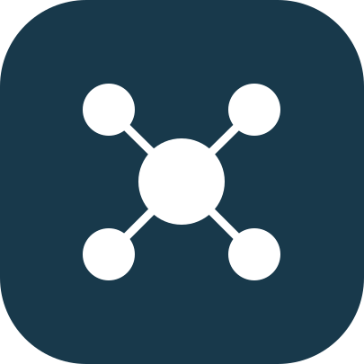
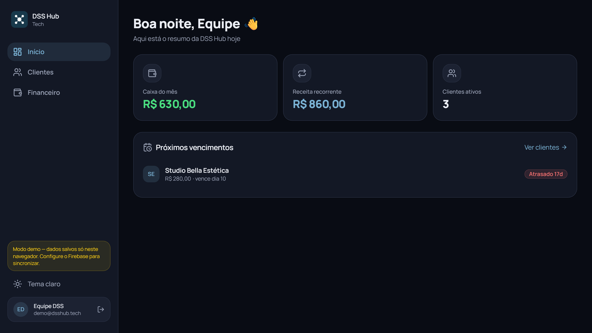
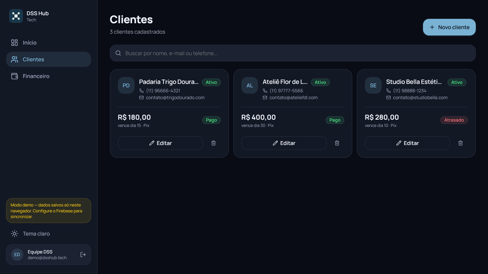
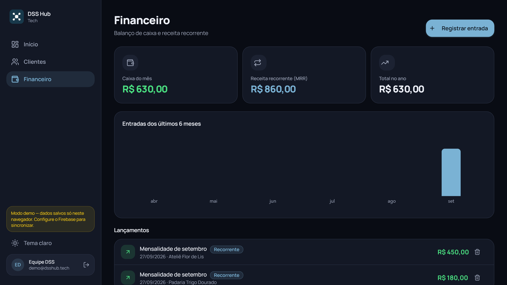
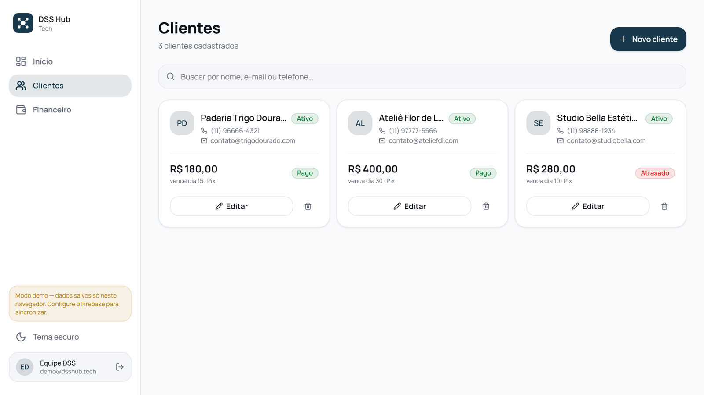
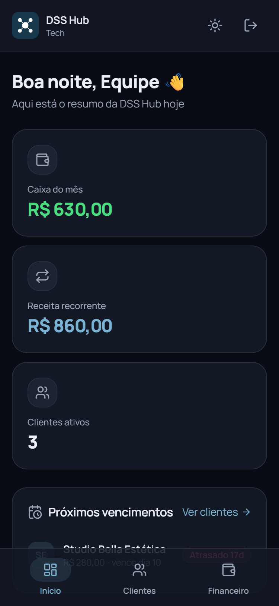
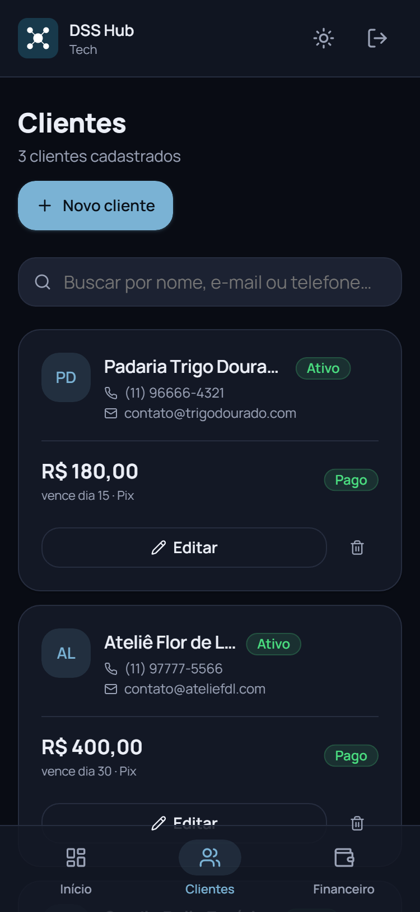

<div align="center">



# DSS Hub

**Clientes, mensalidades e caixa da empresa num lugar só.**

Painel interno da DSS Hub Tech, feito como PWA: instala no computador e no celular, entra só com Google e mantém os dados dos três sócios sincronizados em tempo real.

<br />

[](https://dss-hub-dashboard.vercel.app)

<sub>Acesso restrito à equipe: só entram as contas Google autorizadas.</sub>

<br />


</div>

<br />

## Sobre o projeto

A **DSS Hub Tech** é uma empresa de programação tocada por três sócios, e o painel nasceu de um problema comum: cliente anotado em planilha, link de projeto perdido em conversa de WhatsApp e ninguém sabendo ao certo quanto entrou no mês nem quem está para vencer.

A ideia é simples: uma central onde dá para ver de relance o caixa do mês, a receita recorrente e os próximos vencimentos, e onde cada cliente guarda tudo o que importa sobre ele, inclusive os links do próprio projeto, cada um com descrição e comentário.

O diferencial está nos detalhes do dia a dia. Ao registrar uma entrada no financeiro e escolher o cliente, o status dele vira **Pago** sozinho naquele mês. Quando sai uma versão nova, o app avisa com um botão **Atualizar**, sem precisar limpar cache nem reinstalar. E tudo foi desenhado primeiro para o celular, porque é lá que o painel mais é aberto.

<br />

## Telas

<div align="center">

<table>
  <tr>
    <td align="center"><br /><sub><b>Início</b> · resumo do dia e próximos vencimentos</sub></td>
    <td align="center"><br /><sub><b>Clientes</b> · status Pago automático</sub></td>
  </tr>
  <tr>
    <td align="center"><br /><sub><b>Financeiro</b> · caixa, MRR e gráfico mensal</sub></td>
    <td align="center"><br /><sub><b>Tema claro</b> · o app troca com um toque</sub></td>
  </tr>
</table>

<table>
  <tr>
    <td align="center"><br /><sub><b>Início no celular</b></sub></td>
    <td align="center"><br /><sub><b>Clientes no celular</b></sub></td>
  </tr>
</table>

<sub>Prints tirados no modo demonstração, com dados fictícios.</sub>

</div>

<br />

## Funcionalidades

- **Início** com o caixa do mês, a receita recorrente, os clientes ativos e a lista de próximos vencimentos, com destaque para quem está atrasado.
- **Clientes** com cadastro completo: contato, forma e dia de pagamento, valor da mensalidade, status e observações livres.
- **Links dentro do cliente** — quantos precisar, cada um com descrição, endereço e um espaço para comentar o que for útil (onde acessa, qual o plano, o que combinaram).
- **Status Pago automático** — registrou a entrada e escolheu o cliente, ele fica como Pago no mês e sai dos próximos vencimentos. Sem pagamento, o status segue o dia de vencimento: a vencer, vence hoje ou atrasado.
- **Financeiro** com lançamentos de entrada, cálculo da receita recorrente (MRR) e gráfico dos últimos seis meses.
- **Login só com Google** e lista de e-mails autorizados, protegida também nas regras do banco.
- **Sincronização em tempo real** entre os três sócios, em qualquer aparelho.
- **PWA instalável** no computador e no celular, com botão de instalar e aviso de nova versão.
- **Tema claro e escuro**, com interface pensada para o celular (Android e iPhone, com respeito à área segura do aparelho).

<br />

## Tecnologias

| Camada | Stack |
|--------|-------|
| **Linguagem** | TypeScript |
| **Interface** | React 19 · Tailwind CSS v4 · lucide-react · fonte Manrope |
| **Navegação** | React Router 7 |
| **Gráficos** | Recharts |
| **Autenticação** | Firebase Auth (Google) com lista de e-mails autorizados |
| **Banco de dados** | Cloud Firestore, em tempo real |
| **PWA** | vite-plugin-pwa (service worker, instalação e aviso de atualização) |
| **Build e deploy** | Vite 6 · Vercel |

<br />

## Arquitetura

O acesso aos dados fica isolado numa camada única, o `repo`, que fala com o Firestore quando há nuvem ou com o armazenamento do navegador no modo demonstração. As telas não precisam saber onde os dados moram.

```
src/
├── components/     # Layout, PageHeader, UpdatePrompt, InstallButton e o kit de UI
├── context/        # AuthContext (login) e ThemeContext (claro/escuro)
├── hooks/          # useColecoes (dados em tempo real) e useInstallPrompt
├── lib/
│   ├── firebase.ts # config do Firebase e lista de e-mails autorizados
│   ├── repo.ts     # camada de dados (Firestore ou localStorage)
│   └── utils.ts    # moeda, datas e regras de vencimento e pagamento
├── pages/          # Login, Dashboard, Clientes e Financeiro
└── types.ts        # tipos de Cliente, Lançamento e Link
```

### Segurança dos dados

Como o app fala direto com o Firestore, a proteção fica nas **regras de segurança**: só as contas da lista conseguem ler ou escrever, e todo o resto é negado por padrão. O login com Google sozinho não basta.

```js
// firestore.rules
function emailAutorizado() {
  return request.auth != null &&
    request.auth.token.email in [
      'socia1@exemplo.com',
      'socia2@exemplo.com',
      'socio3@exemplo.com'
    ];
}

match /{document=**} {
  allow read, write: if emailAutorizado();
}
```

<br />

## Como rodar localmente

O projeto já vem ligado à nuvem da DSS Hub (a configuração pública do Firebase fica embutida como reserva), então o `npm run dev` já usa o login Google real e o banco em nuvem. É preciso ter o Node instalado.

```bash
# 1. Clone o repositório
git clone https://github.com/Danyyks/dss-hub-dashboard.git
cd dss-hub-dashboard

# 2. Instale as dependências e rode
npm install
npm run dev
```

3. Abra [http://localhost:5173](http://localhost:5173).

**Modo demonstração.** Para mexer na interface sem logar com o Google, rode com o login fictício. Os dados ficam salvos só no navegador.

```bash
# macOS e Linux
VITE_DEMO=1 npm run dev

# Windows (PowerShell)
$env:VITE_DEMO=1; npm run dev
```

**Apontando para outro Firebase.** Copie `.env.example` para `.env` e preencha as variáveis, que têm prioridade sobre a configuração embutida. Do lado do Firebase:

1. Em Authentication, ative a entrada com Google.
2. Em Firestore Database, crie o banco em modo produção.
3. Em `VITE_ALLOWED_EMAILS`, coloque os e-mails autorizados, separados por vírgula.
4. Publique as regras do arquivo `firestore.rules`, com a mesma lista de e-mails.

**Publicando na Vercel.** Suba o projeto no GitHub e importe na Vercel escolhendo o framework Vite. Repita as chaves do `.env` nas variáveis de ambiente e, no Firebase, adicione o domínio da Vercel em Authentication, na lista de domínios autorizados.

<br />

## Roadmap

- [ ] **Alertas de vencimento** — aviso no painel e notificação push no dia da cobrança.
- [ ] **Linha do tempo por cliente** — histórico do relacionamento.
- [ ] **Divisão de lucro** entre os três sócios.
- [ ] Relatórios e exportação em CSV, com resumo mensal.
- [ ] Permissões diferentes por sócio.

<br />

<div align="center">
<sub>DSS Hub · painel interno da DSS Hub Tech · React + TypeScript + Firebase</sub>
</div>
